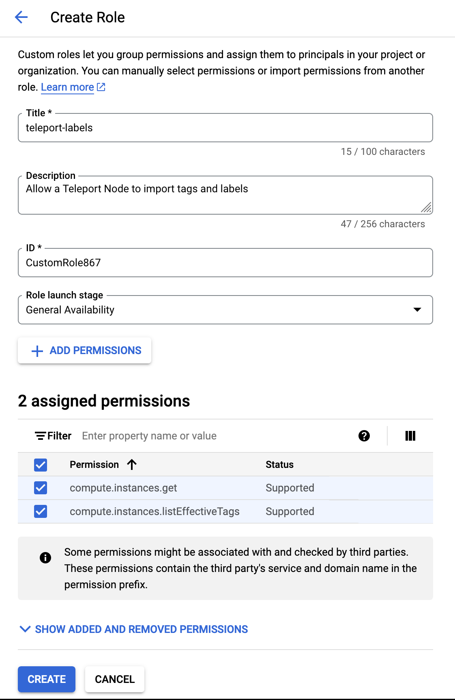
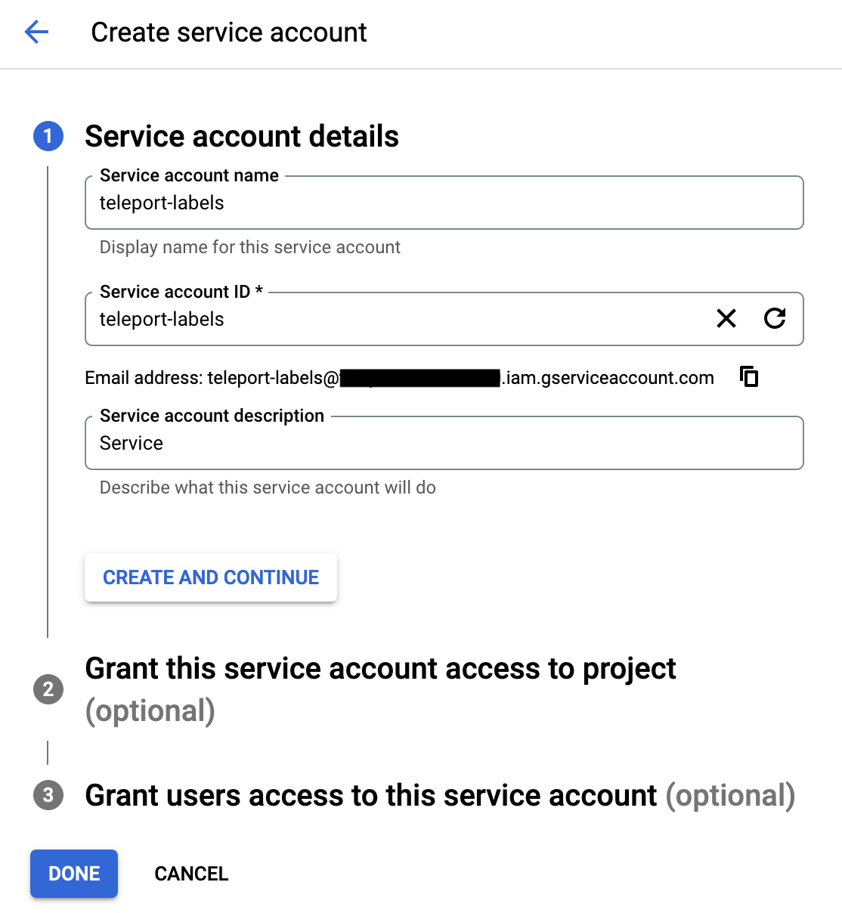
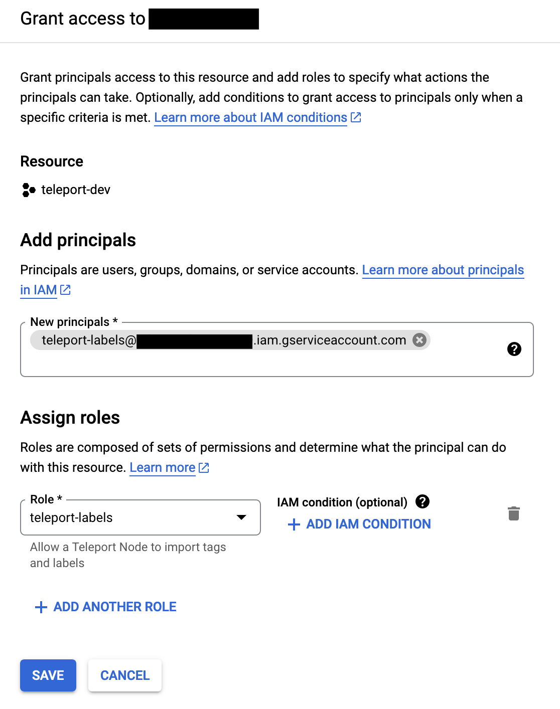

When running on an GCP Compute instance, Teleport will automatically detect and import GCP labels and tags as
Teleport labels for SSH nodes, Applications, Databases, and Kubernetes clusters. Both tags and labels imported
this way will have the `gcp/` prefix; additionally, tags will receive the `tag/` infix and labels will receive
the `label/` infix. So for an instance with label `foo=bar` and tag `baz=quux`, it will have the Teleport labels
`gcp/label/foo=bar` and `gcp/tag/baz=quux`.

When the Teleport process starts, it fetches all tags and labels from 
the GCP API and adds them as labels. The process will update the tags every hour, 
so newly created or deleted tags will be reflected in the labels.

If the label `TeleportHostname` (case-sensitive) is present, its value will override the node's hostname.

```bash
$ tsh ls
Node Name            Address        Labels                                                                                                                  
-------------------- -------------- -------------------------------------------------------------------------------------------
fakehost.example.com 127.0.0.1:3022 gcp/label/testing=yes,gcp/tag/environment=staging,aws/TeleportHostname=fakehost.example.com
```

<Notice type="note">
  For services that manage multiple resources (such as the Database Service), each resource will receive the
  same tags and labels from GCP.
</Notice>

## Prerequisites

(!docs/pages/includes/edition-prereqs-tabs.mdx!)
- One Teleport agent running on a GCP Compute instance. See
  [our guides](../../agents/join-services-to-your-cluster.mdx) for how to set up Teleport agents.

## Configure service account on instances with Teleport nodes

Create a service account that will give Teleport the IAM permissions needed
to import tags and labels.

<Tabs>
<TabItem label="Console">
  Go to [IAM > Roles](https://console.cloud.google.com/iam-admin/roles)
  in the GCP console and click *+ Create Role*.
  Pick a name for the role (e.g. `teleport-label`) and give it the following permissions:
  - `compute.instances.get`
  - `compute.instances.listEffectiveTags`

  

  Click *Create*.

  Go to [IAM > Service accounts](https://console.cloud.google.com/iam-admin/serviceaccounts)
  and click *+ Create Service Account*. Pick a name for the service account
  (e.g. `teleport-labels`) and copy its email address to your clipboard.
  Click *Create and Continue*.

  

  Go to [IAM](https://console.cloud.google.com/iam-admin/iam) and click *Grant Access*.
  Paste the service account's email into the *New principals* field and select
  your custom role. Click *Save*.

  
</TabItem>
<TabItem label="gcloud">
  Copy the following and paste it into a file called `teleport-labels-role.yaml`:
  ```yaml
  # teleport-labels-role.yaml
  title: "teleport-labels"
  description: "A role to enable Teleport to import tags and labels"
  stage: "ALPHA"
  includedPermissions:
  - compute.instances.get
  - compute.instances.listEffectiveTags
  ```

  Then run the following command to create the role:
  ```code
  $ gcloud iam roles create teleport_labels \
  --project=<Var name="project_id" description="GCP project ID" /> \
  --file=teleport-labels-role.yaml
  ```

  Run the following command to create the service account:
  ```code
  $ gcloud iam service-accounts create teleport-labels \
  --description="A service account to enable Teleport to import tags and labels" \
  --display-name="teleport-labels"
  ```

  Run the following command to add the new role to the new service account:
  ```code
  $ gcloud projects add-iam-policy-binding <Var name="project_id" description="GCP project ID" /> \
  --member="serviceAccount:teleport-labels@<Var name="project_id" />.iam.gserviceaccount.com" \
  --role="projects/<Var name="project_id" />/roles/teleport_labels"
  ```
</TabItem>
</Tabs>

If you want to only import labels or only import tags, you can leave
`compute.instances.listEffectiveTags` or `compute.instances.get`
out of your created service account's permissions, respectively.